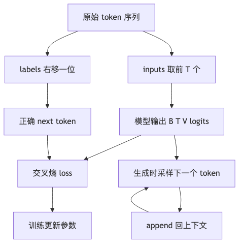

# 第 2 章：语言模型的概率目标

## 1. 本章真正要解决的问题

第 1 章训练的是分类器：输入一个向量，输出一个类别。现在我们换一个更像 LLM 的问题：

> 给模型一句话的开头，它怎么继续写下去？

直觉上，模型好像是在“输出一句话”。但训练时不能直接监督“整句话好不好”，因为一句话可以有很多种合理写法。于是语言模型把问题拆小：

> 不一次生成整句，而是在每个位置预测下一个 token。

例如我们的贯穿小语料是：

```text
合同 违约金 过高 ， 它 可能 存在 风险 <eos>
```

训练时它会被拆成一串监督关系：

```text
合同   -> 违约金
违约金 -> 过高
过高   -> ，
，      -> 它
它      -> 可能
```

本章真正要补上的能力是：

```text
把“续写文本”改写成可训练、可评测、可生成的 next-token prediction。
```

## 2. 问题链

1. 原始状态：分类器只能输出固定标签，不能输出可变长度文本。
2. 新问题：文本生成看起来是“写一句话”，但训练时需要可计算的监督目标。
3. 新机制：把整句概率分解成一连串 next-token probability：

   ```text
   P(x_1, ..., x_T) = ∏ P(x_t | x_<t)
   ```

4. 工程转化：给模型 `tokens[:, :-1]`，让它预测 `tokens[:, 1:]`。
5. 训练信号：每个位置输出 vocab 大小的 logits，用 cross entropy 监督正确 next token。
6. 推理边界：训练时有真实前缀，生成时只能使用模型自己已经生成的 token。
7. 新问题：模型需要的是 token id，但真实输入是字符串。下一章进入 Tokenizer 与 Dataset。

<



## 3. Concept Card

| 概念 | 数学对象 | Shape | 代码对象 | 实验对象 |
| --- | --- | --- | --- | --- |
| 语料 | token 序列 | `(N,)` 或 `(B, T)` | `input_ids` | 中文小语料 |
| logits | 每个位置的类别分数 | `(B, T, V)` | `model(input_ids)` | 检查 vocab 维度 |
| labels | 右移一位的目标 token | `(B, T)` | `targets` | 验证错位关系 |
| loss | 负对数似然均值 | `()` | `nn.CrossEntropyLoss` | loss 是否下降 |
| generate | 自回归采样 | 逐步增长 | `generate()` | 温度和 top-k 对比 |

## 4. Shape 契约

最小语言模型的训练 batch 应该满足：

```text
tokens:  LongTensor[B, T + 1]
inputs:  tokens[:, :-1] -> LongTensor[B, T]
labels:  tokens[:, 1:]  -> LongTensor[B, T]
logits:  FloatTensor[B, T, V]
loss:    CE(logits.reshape(B*T, V), labels.reshape(B*T))
```

注意：`logits.argmax(-1)` 得到的是每个位置最可能的 next token，不是整句答案。生成循环必须把新 token append 回上下文。

这里的“右移一位”是语言模型训练的核心。给定一段 token：

```text
合同 违约金 过高 ， 它 可能 存在 风险 <eos>
```

训练时模型看到的监督关系是：

```text
合同   -> 违约金
违约金 -> 过高
过高   -> ，
，      -> 它
它      -> 可能
```

如果把 input 和 label 对齐成同一个 token，loss 可能下降得很快，但模型学到的是复制当前 token，而不是预测下一个 token。这种 bug 很隐蔽，因为训练曲线会显得“很好看”，生成时却会反复输出同类 token。

训练脚本里应该把这个关系写成断言，而不是只靠肉眼看：

```python
assert torch.equal(inputs[:, 1:], labels[:, :-1])
```

一个最小 batch 可以这样人工检查：

| 项 | 正确 LM batch | 错误 batch |
| --- | --- | --- |
| `inputs` | `合同 违约金 过高` | `合同 违约金 过高` |
| `labels` | `违约金 过高 ，` | `合同 违约金 过高` |
| 学到的目标 | 预测下一个 token | 复制当前 token |
| 生成后果 | 有机会续写 | 容易重复 |

训练和生成还有一个重要差异：训练时每个位置都能看到真实历史，这叫 teacher forcing；生成时模型只能看到自己已经生成的历史。一个小错误会进入上下文，影响后续所有 token。这就是为什么只看训练 loss 不够，必须真的跑 `generate()`。

### loss 和 perplexity：为什么一个标量能代表预测难度

Cross entropy loss 可以理解为：

> 模型给正确 next token 的概率越高，loss 越低；概率越低，loss 越高。

如果平均 loss 是 `L`，perplexity 通常写成：

```text
perplexity = exp(L)
```

它可以粗略理解为：模型在每个位置平均“困惑于多少个候选 token”。perplexity 越低，说明模型对正确 next token 越有把握。

但它有边界：

- perplexity 只能评估 next-token 预测，不等于回答质量。
- 小语料上 perplexity 很低，可能只是过拟合。
- 对 SFT、RAG、法律/医学问答，后面还必须看格式准确率、事实准确率、引用准确性和安全拒答。

## 5. 最小实现

本章的最小模型可以先从 neural bigram language model 开始：

```python
class BigramLanguageModel(nn.Module):
    def __init__(self, vocab_size: int, hidden_dim: int) -> None:
        super().__init__()
        self.token_embedding = nn.Embedding(vocab_size, hidden_dim)
        self.lm_head = nn.Linear(hidden_dim, vocab_size)

    def forward(self, input_ids: torch.Tensor) -> torch.Tensor:
        hidden = self.token_embedding(input_ids)
        return self.lm_head(hidden)
```

它的含义是：

```text
当前 token id
  -> 查 embedding
    -> 投影成 vocab logits
      -> 预测下一个 token
```

这个模型没有真正看更长历史。严格说，如果 `hidden_dim < vocab_size`，它还是一个低秩参数化的 bigram baseline，而不是完整的 bigram 转移表。

它很弱，但教学价值很高：它能帮我们验证四件事：

1. `input_ids` 和 `labels` 是否右移；
2. logits shape 是否是 `[B, T, V]`；
3. cross entropy 是否接对；
4. `generate()` 是否真的能循环生成 token。

它没有解决长上下文问题。看到“它”这个 token 时，它不知道“它”指的是“违约金”还是“合同”。这个缺口会自然引出后面的 Embedding 上下文模型和 Attention。

本章可以把实验控制得很小：用几十个字符训练一个 bigram LM，确认 loss 能下降、生成能工作、采样参数会改变输出。小实验可解释，才能在后面模型变复杂时定位问题。

## 6. 必写实验

- 过拟合一小段文本：比如重复的中文诗句或项目 README 片段。
- 比较 greedy、temperature、top-k、top-p：观察输出重复、发散和多样性。
- 故意不右移 label：模型会学成“复制当前 token”，生成质量虚高。
- 故意把 padding 计入 loss：观察模型过度学习 `<pad>`。
- 固定 seed：同一训练配置和采样配置应复现同一输出。

## 7. 失败模式

- `logits` 和 `labels` shape 没 flatten 对：cross entropy 会报错或静默训练错目标。
- 把 padding token 也计入 loss：模型会过度学习补齐符号。
- 训练 loss 下降但生成全是重复 token：bigram 模型上下文能力不够，不是训练循环必然坏。
- 生成时忘记裁剪 context：后续 Transformer 会超过最大上下文长度。

## 8. 测试验收

本章 tests 至少验证：

1. `make_lm_batch()` 返回的 `inputs` 与 `labels` 正确错位。
2. `BigramLanguageModel` 输出 shape 是 `(B, T, V)`。
3. 单步训练会更新 embedding 和 lm head 参数。
4. 小语料 overfit 后 loss 明显下降。
5. `generate()` 输出长度正确，且不会生成 vocab 外 token。
6. `perplexity == exp(loss)`。

## 9. 本章记忆锚点与边界

本章最重要的一句话是：

> 语言模型不是一次性学会“写完整句子”，而是在每个位置学习预测下一个 token。

你需要记住：

1. `inputs = tokens[:, :-1]`
2. `labels = tokens[:, 1:]`
3. `logits.shape = [B, T, V]`
4. `loss = CE(logits.reshape(B*T, V), labels.reshape(B*T))`
5. 训练时用真实历史，生成时用模型自己生成的历史。

本章没有解决两个问题：

- 字符串怎么稳定变成 token id；
- 模型怎么利用更长上下文。

## 10. 下一章

我们已经知道语言模型需要 `input_ids`。但真实文本是字符串，字符串到数字的过程会决定 vocab、未知词、padding、batch 和评测一致性。下一章进入 Tokenizer 与 Dataset。
