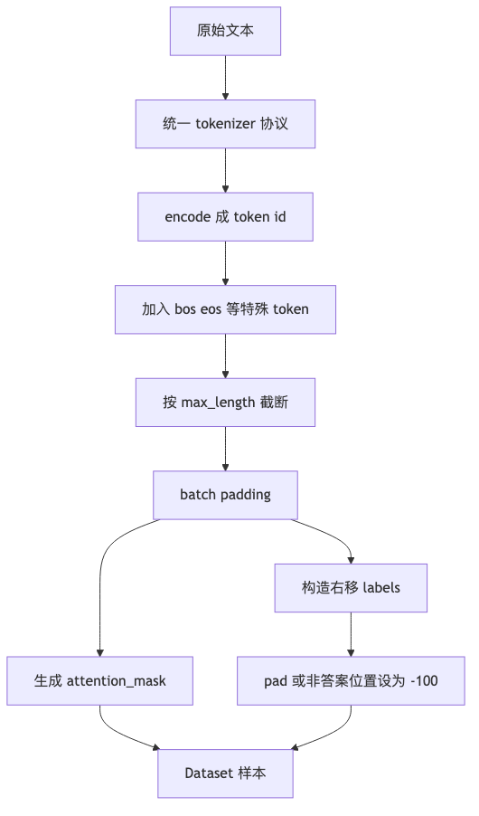

# 第 3 章：Tokenizer 与数据集构造

## 1. 本章真正要解决的问题

语言模型只能处理整数 id，但用户、文档和训练集都是文本。Tokenizer 不是“预处理小工具”，而是模型输入空间的定义：它决定 vocab 有多大、长词如何拆、未知字符如何处理、padding 是否进入 loss。

核心问题：

```text
如何把文本稳定变成 token id，并构造成 language modeling / SFT 都能复用的数据集？
```

## 2. 问题链

1. 字符串不能直接输入模型。
2. 字符级 tokenizer 简单，但序列长、语义碎。
3. 词级 tokenizer 易懂，但开放词表会导致大量 OOV。
4. 子词方法在字符级和词级之间折中：常见片段合并，罕见词可拆解。
5. batch 需要 padding、truncation、attention mask。
6. 下一章问题：token id 只是编号，模型如何从编号中学出可更新的语义表示？

<



## 3. Concept Card

| 概念 | 数学对象 | Shape | 代码对象 | 实验对象 |
| --- | --- | --- | --- | --- |
| vocab | token 到 id 的映射 | `V` | `token_to_id` | 检查特殊 token |
| encode | 文本到 id | `(T,)` | `encode(text)` | round-trip |
| decode | id 到文本 | 字符串 | `decode(ids)` | 可逆性 |
| attention mask | 有效位置标记 | `(B, T)` | `attention_mask` | padding 不参与 |
| labels | LM 监督目标 | `(B, T)` | `labels` | pad 位置为 `-100` |

## 4. Tokenizer 最小契约

一个教学 tokenizer 至少需要：

```text
special tokens: <pad>, <unk>, <bos>, <eos>
encode(text, add_special_tokens=True) -> list[int]
decode(ids, skip_special_tokens=True) -> str
batch_encode(texts, max_length, padding, truncation) -> input_ids, attention_mask
```

对 LM 数据集，还需要从连续 token 流中切块：

```text
corpus_ids: LongTensor[N]
sample: input_ids = corpus_ids[i : i + block_size]
        labels    = corpus_ids[i + 1 : i + block_size + 1]
```

对 SFT 数据集，还要区分哪些位置参与 loss：通常 user/system 部分只作为上下文，assistant 回答部分才作为 label。

Tokenizer 是模型和文本世界之间的协议。训练、评测、推理、部署必须使用同一个协议，否则同一句话会变成不同 id 序列，模型行为也会改变。尤其是 chat model，system / user / assistant 的边界 token 不是装饰，而是模型理解角色的信号。

特殊 token 要从一开始就固定：

```text
<pad>: batch 补齐，不应参与 loss
<unk>: 未知字符或未知片段
<bos>: 序列开始
<eos>: 序列结束，生成停止信号
```

如果没有 `<eos>`，生成只能靠最大长度硬停；如果 `<pad>` 参与了 loss，模型会被训练成在很多位置预测 padding。看起来只是数据处理细节，实际会直接污染训练目标。

### attention mask 和 label mask 不是一回事

初学者最容易把两个 mask 混在一起：

```text
attention_mask: 这个位置能不能被模型看见
labels == -100: 这个位置算不算 loss
```

例如 batch padding 后：

```text
input_ids:      [合同, 违约金, <eos>, <pad>, <pad>]
attention_mask: [1,    1,      1,     0,     0]
labels:         [违约金, <eos>, -100, -100, -100]
```

`attention_mask=0` 是告诉模型：pad 位置只是补齐，不应该作为上下文信息。
`labels=-100` 是告诉 loss：这个位置不要计算监督信号。

可以把两个 mask 的职责记成这张表：

| mask | 控制什么 | 谁使用 | 错了会怎样 |
| --- | --- | --- | --- |
| `attention_mask` | 模型能不能把该位置当上下文 | attention / model forward | pad 污染上下文 |
| `labels == -100` | loss 是否监督该位置 | loss function | pad、user 或 system 被训练成目标 |

在 SFT 里还会出现另一种 label mask：

```text
system / user:      只作为上下文，不算 loss
assistant answer:   作为目标答案，计算 loss
```

所以 Dataset 不只是返回 `input_ids`。至少要返回：

```text
input_ids
attention_mask
labels
source_id
```

后面的 RAG、蒸馏和评测还会需要 `source_id` 来追踪样本来源，避免数据泄漏。

如果没有 `source_id`，后面排查会变成猜谜：评测集里一条“责任上限缺失”答得很好，你无法知道它是否来自同一个合同模板、是否已经进入训练、是否经过脱敏、是否允许用于发布报告。`source_id` 不是元数据洁癖，而是数据泄漏和合规边界的最低成本证据。

## 5. 为什么需要子词：字符级太长，词级太脆

先不要急着背 BPE 或 WordPiece 的定义。我们先看原始困难。

假设语料里有一句：

```text
合同违约责任过重
```

字符级 tokenizer 会切成：

```text
合 / 同 / 违 / 约 / 责 / 任 / 过 / 重
```

它几乎不会 OOV，因为任何中文字符都可以进入 vocab。但问题是序列会变长，模型要处理的上下文也变长。

词级 tokenizer 可能切成：

```text
合同违约责任 / 过重
```

序列短了，但遇到没见过的新词、错别字、专业术语时容易变成 `<unk>`。

子词方法试图折中：

```text
合同 / 违约 / 责任 / 过重
```

常见片段可以合并，罕见词仍然可以拆开。这样既不会像字符级那么长，也不会像词级那样一遇到新词就崩。

BPE 和 WordPiece 都属于常见的子词方法，但它们的合并准则并不完全一样。本章只讲共同直觉：

> 子词不是因为“理解语义”才有效，而是因为它在开放词表和序列长度之间做了工程折中。

例如“合同违约责任”可以被拆成：

```text
字符级: 合 / 同 / 违 / 约 / 责 / 任
词级: 合同违约责任
子词级: 合同 / 违约 / 责任
```

哪种最好取决于语料、模型和任务。课程里先写 simple tokenizer，是为了看清楚 encode、decode、padding、mask 和 label 的契约；理解契约后，再换成真实 tokenizer 才不容易把问题归咎于库。

Dataset 构造也要保留来源。后续 SFT、RAG、蒸馏、评测都会问：这个样本从哪里来，是否和 eval 泄漏，是否有风险标签。数据对象如果一开始只有 `input_ids`，后面就很难审计。

## 6. 必写实验

- 字符级 tokenizer 与简单 BPE tokenizer 在同一段文本上的 token 数对比。
- `max_length` 太小时观察 truncation 如何截断答案。
- padding 进入 loss 与 pad label 设为 `-100` 的 loss 对比。
- 构造 SFT 样例，验证 assistant 以外位置不计入 loss。

## 7. 失败模式

- 训练和推理 tokenizer 不一致：同一句话得到不同 id，模型行为不可解释。
- 忘记 `<eos>`：生成循环不知道何时停止。
- padding token 没 mask：模型学会输出 pad。
- 中文按空格分词：大量句子会被当成单个未知词。
- chat template 改动后旧数据不可复现。

## 8. 测试验收

本章 tests 至少验证：

1. 特殊 token id 固定且互不冲突。
2. `decode(encode(text))` 对基础字符集近似可逆。
3. batch padding 后 `input_ids` 和 `attention_mask` shape 一致。
4. LM dataset 的 `input_ids` 和 `labels` 正确右移。
5. SFT dataset 中非 assistant label 被置为 `-100`。
6. tokenizer mismatch 会改变同一句话的 id 序列，应被测试暴露。

## 9. 本章记忆锚点与边界

本章最重要的一句话是：

> Tokenizer 不是预处理小工具，而是模型输入空间的协议。

你需要记住：

1. 训练、评测、推理必须使用同一个 tokenizer。
2. `<pad>` 不应参与 loss。
3. `<eos>` 是生成停止的重要信号。
4. `attention_mask` 控制能不能看，`labels=-100` 控制算不算 loss。
5. chat template 是角色边界协议，不是字符串装饰。

本章没有解决 token id 的语义问题。`42` 只是编号，并不天然比 `41` 更接近某个词。下一章要让模型学习 embedding。

## 10. 下一章

现在文本已经变成 token id。但 id 只是离散编号，编号之间没有距离和语义。下一章用 embedding table 把离散 token 映射到可训练向量。
