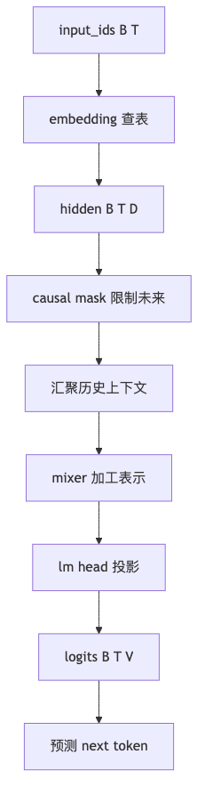

# 第 4 章：Embedding 与神经语言模型

## 1. 本章真正要解决的问题

Tokenizer 已经把文本变成了 token id。但 token id 只是编号：

```text
合同 -> 17
违约金 -> 42
过高 -> 91
```

`42` 并不比 `17` 更“接近”法律语义。编号只是查表索引，不是含义。

所以本章第一个问题是：

> 模型如何把离散 token id 变成可训练向量？

但只把 id 变成向量还不够。看这个句子：

```text
合同 违约金 过高 ， 它 可能 存在 风险
```

如果模型只看当前 token “它”，它不知道“它”指的是“违约金”还是“合同”。所以本章还有第二个问题：

> 在进入 Attention 之前，能不能先用一个简单上下文窗口，让模型不只看当前 token？

本章要补上的能力是：

```text
token id -> embedding -> causal context vector -> next-token logits
```

## 2. 问题链

1. 原始状态：token id 只是离散编号，id 大小没有语义距离。
2. 问题一：one-hot 维度等于 vocab，稀疏且不能表达相似性。
3. 新机制一：embedding table 把 token id 查表成 dense vector。
4. 新边界一：只查当前 token 仍然不知道上下文。
5. 问题二：next-token prediction 往往依赖前面多个 token。
6. 新机制二：用 fixed causal context mixer 汇聚历史 token。
7. 新边界二：固定平均或固定窗口不能动态决定“该看谁”。
8. 下一章问题：如何让每个位置根据当前上下文动态选择信息来源？这会引出 causal self-attention。

<



## 3. Concept Card

| 概念 | 数学对象 | Shape | 代码对象 | 实验对象 |
| --- | --- | --- | --- | --- |
| embedding table | 可训练矩阵 | `(V, D)` | `nn.Embedding` | 行更新检查 |
| token embeddings | 查表结果 | `(B, T, D)` | `hidden` | norm / cosine |
| causal context | 历史汇聚向量 | `(B, T, D)` | `causal_mean()` / `context_mixer` | no-future test |
| lm head | 投影回词表 | `(D, V)` | `nn.Linear` | logits shape |
| pad row | 不训练的占位行 | `(D,)` | `padding_idx` | pad 不更新 |

## 4. Shape 契约

```text
input_ids: LongTensor[B, T]
attention_mask: LongTensor[B, T]
embedding.weight: FloatTensor[V, D]
hidden: FloatTensor[B, T, D]
context: FloatTensor[B, T, D]
logits: FloatTensor[B, T, V]
labels: LongTensor[B, T]
loss: scalar
```

`nn.Embedding` 的输入必须是整数 id。它的输出可以参与梯度计算，但 `input_ids` 本身不可导。

Embedding 可以理解成一个可训练查表：

```text
input_ids[b, t] = 42
hidden[b, t] = embedding.weight[42]
```

反向传播时，只有 batch 中出现过的 token 行会收到梯度。没有出现的 token 不会在这一轮更新。这一点很重要：低频 token 学得慢，不是因为它们“难懂”，而是因为训练信号少。

`padding_idx` 是另一个容易忽略的细节。如果 pad token 的 embedding 被正常更新，模型会逐渐给 padding 学出某种“含义”，而 padding 本来应该只是占位。后续 attention mask、label mask 和 padding embedding 要一起保证 pad 不污染训练。

## 5. 最小实现：从当前 token 模型到 causal context 模型

先看最弱的版本：

```python
class CurrentTokenLM(nn.Module):
    def __init__(self, vocab_size: int, hidden_dim: int, padding_idx: int | None = None) -> None:
        super().__init__()
        self.token_embedding = nn.Embedding(
            vocab_size,
            hidden_dim,
            padding_idx=padding_idx,
        )
        self.lm_head = nn.Linear(hidden_dim, vocab_size)

    def forward(self, input_ids: torch.Tensor) -> torch.Tensor:
        hidden = self.token_embedding(input_ids)   # [B, T, D]
        logits = self.lm_head(hidden)              # [B, T, V]
        return logits
```

这个模型解决了：

```text
id -> vector -> logits
```

但它没有解决上下文。每个位置只看自己。

为了让模型至少能看历史，我们加一个最简单的 causal mean mixer：

```python
def causal_mean(hidden: torch.Tensor, attention_mask: torch.Tensor | None = None) -> torch.Tensor:
    """
    hidden: [B, T, D]
    attention_mask: [B, T], 1 表示有效 token，0 表示 pad
    return: [B, T, D]
    """
    bsz, seq_len, dim = hidden.shape
    device = hidden.device

    causal = torch.tril(torch.ones(seq_len, seq_len, device=device))  # [T, T]

    if attention_mask is not None:
        key_mask = attention_mask[:, None, :].float()                 # [B, 1, T]
        weights = causal[None, :, :] * key_mask                       # [B, T, T]
    else:
        weights = causal[None, :, :].expand(bsz, -1, -1)              # [B, T, T]

    denom = weights.sum(dim=-1, keepdim=True).clamp_min(1.0)
    weights = weights / denom

    return weights @ hidden                                           # [B, T, D]
```

这里的 `attention_mask` 主要是在 mask key：有效 token 不应该读取 pad 作为历史信息。如果某个 query 位置本身就是 pad，上面的实现仍可能为它汇聚前面的有效 token。只要这些 pad query 的 label 被设为 `-100`，通常不会影响 loss；但如果你要把中间 hidden 用于可视化、pooling 或下游模块，最好在返回前再用 query mask 把 pad query 的输出清零。

然后模型变成：

```python
class CausalMeanLanguageModel(nn.Module):
    def __init__(self, vocab_size: int, hidden_dim: int, padding_idx: int | None = None) -> None:
        super().__init__()
        self.token_embedding = nn.Embedding(
            vocab_size,
            hidden_dim,
            padding_idx=padding_idx,
        )
        self.mixer = nn.Sequential(
            nn.Linear(hidden_dim, hidden_dim),
            nn.GELU(),
            nn.Linear(hidden_dim, hidden_dim),
        )
        self.lm_head = nn.Linear(hidden_dim, vocab_size)

    def forward(
        self,
        input_ids: torch.Tensor,
        attention_mask: torch.Tensor | None = None,
    ) -> torch.Tensor:
        hidden = self.token_embedding(input_ids)              # [B, T, D]
        context = causal_mean(hidden, attention_mask)         # [B, T, D]
        context = self.mixer(context)                         # [B, T, D]
        logits = self.lm_head(context)                        # [B, T, V]
        return logits
```

这仍然不是 Attention。它只是把历史 token 平均起来。它的价值是让我们看见一个中间台阶：

```text
当前 token 模型：只看自己
causal mean 模型：看历史，但每个历史位置权重固定
attention 模型：看历史，并且动态决定每个位置看谁
```

本章也还没有正式解决位置问题。Causal mean 按顺序累积历史，所以它隐含利用了位置顺序；但真正的 GPT 还需要 position embedding 或 RoPE 一类机制，让模型区分“同一个 token 出现在第 2 位还是第 20 位”。这个缺口会在第 7 章 Mini GPT 里补上。

### 重要边界：上下文汇聚必须是 causal 的

一个很常见的错误写法是：

```python
context = hidden.mean(dim=1, keepdim=True).expand_as(hidden)
```

这会让第 1 个位置也看到第 5 个位置的信息。训练 loss 可能会很好看，但模型是在偷看未来。

语言模型里的上下文汇聚必须满足：

```text
位置 i 的输出只能依赖位置 <= i 的 token
```

所以本章 tests 不能只检查 shape，还要检查：

```text
修改未来 token，不应改变过去位置的 logits。
```

## 6. 必写实验

- 当前 token LM vs causal mean LM：比较 tiny corpus overfit 速度。
- 检查 `embedding.weight.grad`：只出现过的 token 行应有梯度。
- 检查 `padding_idx`：pad embedding 行不应更新。
- 修改未来 token：验证过去位置 logits 不变。
- 故意使用非 causal mean：观察训练 loss 虚低，但生成质量变差。
- 可视化若干 token embedding 的 cosine similarity，观察训练前后变化。

## 7. 失败模式

- vocab size 与 tokenizer 不一致：embedding 查表越界。
- `padding_idx` 未设置：pad embedding 也被训练出“含义”。
- 只写逐位置 MLP：模型看起来是 neural LM，但没有任何上下文能力。
- 使用整段 mean pooling：模型偷看未来，训练 loss 虚低。
- hidden_dim 过小：模型容量不足，tiny corpus 都难以过拟合。
- 以为 embedding 自带语义：语义来自训练目标和数据，不来自 id 顺序。

## 8. 测试验收

本章 tests 至少验证：

1. embedding 输出 shape 是 `(B, T, D)`。
2. logits 输出 shape 是 `(B, T, V)`。
3. 训练一步后，出现过的 token embedding 被更新。
4. 设置 `padding_idx` 后，pad token embedding 不被更新。
5. causal context mixer 输出 shape 正确。
6. 修改未来 token 不改变过去位置 logits。
7. 故意使用非 causal pooling 时，no-future test 应失败。
8. tiny corpus 上 loss 可以下降。

## 9. 本章记忆锚点与边界

本章解决了两个问题：

1. token id 没有语义，embedding table 让 id 变成可训练向量。
2. 当前 token 不够用，causal context mixer 让模型至少能看历史。

但本章没有解决：

```text
不同历史 token 的重要性应该如何动态变化？
```

固定平均会把“合同”“违约金”“它”混在一起。可是当模型看到“它”时，真正应该重点回看的可能是“违约金”。下一章的 Attention 就是为了解决这个“动态看谁”的问题。
