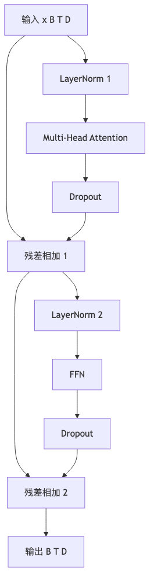

# 第 6 章：Transformer Block

## 1. 本章真正要解决的问题

第 5 章的 causal self-attention 已经能让每个 token 动态回看历史位置。那为什么还不能直接把 attention 堆很多层，称它为 GPT？

问题在于：attention 只是一次信息混合。它能回答“当前位置该看哪些历史位置”，但还没有解决三个工程问题：

1. **表达不够**：一个 attention 视角很难同时处理局部搭配、长程指代、格式边界和引用关系。
2. **堆深不稳**：层数增加后，激活尺度和梯度路径可能变得难以训练。
3. **只混合不加工**：attention 主要做跨位置信息路由，还需要逐位置的非线性变换来加工特征。

所以 Transformer Block 出现，不是为了堆术语，而是为了把 attention 变成一个可以稳定堆叠的基本模块：

```text
多头：并行看不同关系
残差：保留直通路径
LayerNorm：稳定特征尺度
FFN：逐位置非线性加工
Dropout：训练时正则化
```

核心问题：

```text
attention 如何变成可以深层堆叠、稳定训练的 LLM 基本模块？
```

## 2. 问题链

1. 原始状态：单头 attention 能动态看历史，但只是一次信息混合。
2. 新问题一：一个 head 的表达视角有限，难以同时学习多种关系。
3. 新机制一：multi-head attention 把 hidden dimension 拆成多个子空间，并行学习不同路由。
4. 新问题二：堆深后，每层都重写表示会让梯度和信息传递不稳定。
5. 新机制二：residual connection 让模块只做增量修改，原表示有直通路径。
6. 新问题三：深层网络中激活尺度容易漂移。
7. 新机制三：LayerNorm 在每个位置的 hidden 维度上稳定尺度，pre-norm 更适合深层训练。
8. 新问题四：attention 混合了信息，但还需要逐位置非线性加工。
9. 新机制四：FFN 对每个位置独立做 MLP 变换。
10. 下一章问题：有了可堆叠 block，如何把 embedding、position、block 和 lm head 组成完整 Mini GPT？

<



## 3. Concept Card

| 概念 | 数学对象 | Shape | 代码对象 | 实验对象 |
| --- | --- | --- | --- | --- |
| multi-head | 多个注意力子空间 | `(B, heads, T, Hd)` | `CausalSelfAttention` | head shape |
| residual | 恒等旁路 | `(B, T, D)` | `x + module(x)` | 梯度稳定 |
| LayerNorm | 特征归一化 | `(B, T, D)` | `nn.LayerNorm` | 均值方差 |
| FFN | 逐位置 MLP | `(B, T, D)` | `FeedForward` | 容量对比 |
| dropout | 随机正则 | `(B, T, D)` | `nn.Dropout` | train/eval 差异 |

## 4. Shape 契约

```text
x: FloatTensor[B, T, D]
num_heads: h
head_dim: D / h
qkv: FloatTensor[B, T, 3D]
q,k,v: FloatTensor[B, h, T, head_dim]
attn_out: FloatTensor[B, T, D]
ffn_out: FloatTensor[B, T, D]
block_out: FloatTensor[B, T, D]
```

`D % num_heads == 0` 是硬约束。否则每个 head 的维度无法均分。

Multi-head 的直觉不是“多个 attention 平均一下”，而是把 hidden dimension 切成多个子空间，让不同 head 有机会学习不同关系：有的 head 可能偏向局部相邻 token，有的偏向句法边界，有的偏向引用或格式标记。教学项目不需要神化 attention head，但要理解多头提供的是并行的信息路由能力。多头拼回 `(B, T, D)` 后通常还要经过 output projection，让各 head 的信息重新混合。

mask 在多头 attention 中也要能 broadcast 到 attention score：

```text
attn_scores: FloatTensor[B, h, T, T]
causal_mask: BoolTensor[1, 1, T, T] 或可 broadcast 到该形状
```

如果 mask 只在单头样例里成立，多 batch、多 head 时就可能出现某些 head 偷看未来。

残差连接解决的是另一个问题：模块可以在原表示上做增量修改，而不是每层都被迫重写全部信息。没有 residual，深层网络更容易退化；有 residual，梯度也有更直接的路径穿过网络。

LayerNorm 则让每个位置的特征尺度更稳定。Pre-norm 的形式：

```text
x = x + attention(layer_norm(x))
x = x + ffn(layer_norm(x))
```

在较深 Transformer 中通常更稳，因为 residual 路径保持未归一化的直通通道。

LayerNorm 是对最后一维 hidden features 做归一化，不是对 batch 或 sequence 维度归一化。FFN 通常会先扩张 hidden 维度，例如 `4 * hidden_dim`，再投影回原维度：

```text
FloatTensor[B, T, D] -> FloatTensor[B, T, 4D] -> FloatTensor[B, T, D]
```

## 5. 最小实现结构

```python
class TransformerBlock(nn.Module):
    def __init__(self, hidden_dim, num_heads, dropout):
        super().__init__()
        self.ln_1 = nn.LayerNorm(hidden_dim)
        self.attn = CausalSelfAttention(hidden_dim, num_heads, dropout)
        self.ln_2 = nn.LayerNorm(hidden_dim)
        self.ffn = FeedForward(hidden_dim, dropout)

    def forward(self, x):
        x = x + self.attn(self.ln_1(x))
        x = x + self.ffn(self.ln_2(x))
        return x
```

本章优先实现 pre-norm。post-norm 可以作为对照实验，但不是主路径。

### 为什么只堆 attention 不够

一个只有 attention 的模型可以把历史 token 混进当前位置，但它缺少两个关键能力。

第一，它没有稳定的“保留原信息”的通道。每层都强行改写表示，层数一深，训练更容易退化。残差连接让每个模块只需要学习一个增量：

```text
new_x = old_x + module(old_x)
```

第二，它缺少逐位置的非线性加工。Attention 负责跨 token 交换信息，FFN 负责在每个 token 内部把混合后的信息重新组合。没有 FFN，模型容易变成“只会搬运上下文，不会加工特征”。

所以 Transformer Block 不是 attention 的简单包装，而是一个可堆叠的训练单元。

FFN 经常被初学者低估。Attention 负责跨位置混合信息，FFN 负责在每个位置内部做非线性变换。一个 Transformer block 如果只有 attention，没有 FFN，表达能力会明显受限；如果只有 FFN，没有 attention，又不能动态读取上下文。

Dropout 在教学模型里也值得保留，因为它会逼你区分 `model.train()` 和 `model.eval()`。第 1 章建立的训练习惯在这里继续复用：同一个输入在 train 模式下可能因为 dropout 有随机性，在 eval 模式下应稳定。

本章完成后，学习者应该能把 block 看成一个保持 shape 不变的函数：

```text
TransformerBlock: FloatTensor[B, T, D] -> FloatTensor[B, T, D]
```

保持 shape 不变，才方便堆叠多层。

## 6. 必写实验

- 验证不同 head 数下输出 shape 不变。
- 对比有无 residual 的训练 loss 和梯度 norm。
- 对比 train/eval 下 dropout 行为。
- 堆叠 1、2、4 层 block，观察小语料 overfit 能力。
- 故意只堆 attention、不加 residual / norm / FFN，观察深层训练不稳定或表达不足。

## 7. 失败模式

- 忘记 `.contiguous()` 后直接 `view`：多头 reshape 可能报错或行为异常。
- mask broadcast 维度错：某些 batch/head 偷看未来。
- FFN hidden size 太小：block 容量不足。
- 没有 residual：深层训练更容易退化。
- 把 LayerNorm 理解成 batch norm：归一化维度错，训练行为会变形。

## 8. 测试验收

本章 tests 至少验证：

1. `hidden_dim % num_heads != 0` 时显式报错。
2. block 输入输出 shape 完全一致。
3. causal mask 对所有 head 生效。
4. train/eval dropout 行为不同。
5. 堆叠多个 block 后反传梯度非零且无 NaN。

## 9. 本章记忆锚点与边界

本章最重要的一句话是：

> Transformer Block 把 attention 从一次信息混合，变成了可堆叠、可训练、可复用的语言模型基本模块。

你需要记住：

1. Multi-head 解决多个关系并行路由。
2. Residual 解决信息和梯度直通。
3. LayerNorm 解决 hidden features 的尺度稳定。
4. FFN 解决逐位置非线性加工。
5. Dropout 要区分 train / eval 行为。

本章没有解决完整语言模型工程。下一章要把 block 放进 Mini GPT，并补上 position、checkpoint、generate 和复现实验。

## 10. 下一章

现在我们有了可堆叠模块。下一章把 tokenizer、embedding、position、Transformer block、lm head、训练循环和 generate 串成 mini GPT。
