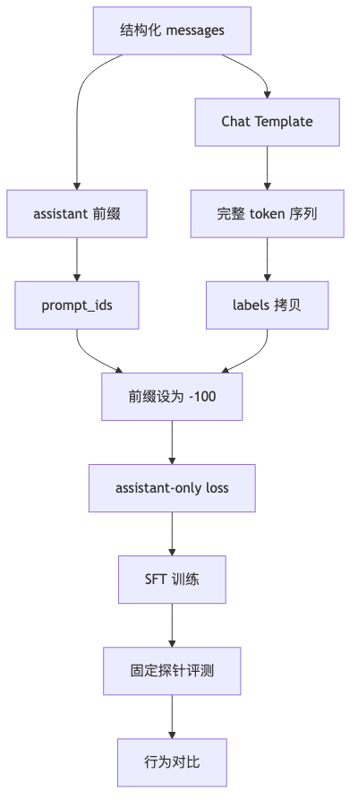

# 第 9 章：SFT 指令微调

## 1. 本章真正要解决的问题

第 8 章学会了加载和微调 causal LM，但 causal LM 的原始目标仍然是“继续写下去”。用户真正想要的是：给模型一个任务、约束、上下文和问题，它按指令产出可用答案。

SFT 的核心不是神奇地“让模型变聪明”，而是用高质量监督样本把模型行为从续写分布拉向指令响应分布。

核心问题：

```text
怎么让模型从“续写文本”变成“按 system / user / assistant 消息格式回答”？
```

贯穿合同例子里，SFT 的目标不是让模型复述“请分析以下条款”，而是让它只输出风险 JSON、证据边界和人工复核标记。

本章使用的是教学 toy SFT 数据：样本少、边界清楚、目标是验证管线。它不能代表领域级 SFT 数据。真正的合同风险模型还需要第 11 章的数据来源、脱敏、去重、许可、风险标签和 eval 冻结；否则第 9 章训练得再顺，也只是学会了一个小格式。

## 2. 问题链

1. Base LM 会续写，不一定会服从用户意图。
2. 指令样本把任务表达成 `instruction -> response` 或多轮 messages。
3. Chat template 把结构化消息变成模型预期的 token 序列。
4. Label mask 决定哪些 token 参与 loss：通常只训练 assistant 回答。
5. Train / val / test split 防止把记忆当能力。
6. 训练前后要比较同一 prompt 的行为，而不只看 loss。
7. 下一章问题：SFT 全量更新成本高，能否只训练少量参数？

<



## 3. Concept Card

| 概念 | 数学对象 | Shape | 代码对象 | 实验对象 |
| --- | --- | --- | --- | --- |
| instruction | 任务描述 | text | `messages[user]` | 指令覆盖 |
| response | 目标答案 | text | `messages[assistant]` | 风格与事实 |
| chat template | 格式函数 | text -> ids | `apply_chat_template` | 模板一致性 |
| labels | 监督 token | `(B, T)` | `labels` | `-100` mask |
| split | 泛化估计 | dataset partitions | `train/val/test` | 泄漏检查 |
| eval prompts | 行为探针 | list[str] | `before_after.md` | 对比输出 |

## 4. 数据格式契约

最小 SFT 样本应保持结构化，不要只保存一条拼好的字符串：

```json
{
  "id": "legal_0001",
  "messages": [
    {"role": "system", "content": "你是谨慎的法律文本助手。"},
    {"role": "user", "content": "解释这段合同条款的风险。"},
    {"role": "assistant", "content": "这段条款的主要风险是..."}
  ],
  "source": "manual",
  "risk_tags": ["contract", "not_legal_advice"]
}
```

结构化字段让后续清洗、去重、脱敏、评测和审计都能追踪来源。拼成纯文本后再想恢复角色边界会非常痛苦。

SFT 数据要同时控制“任务”和“风格”。如果样本只告诉模型要礼貌回答，它可能学会漂亮话；如果样本只给事实答案，它可能忽略 system 约束。一个高质量 SFT 样本通常同时包含：

```text
任务：用户到底要模型做什么
上下文：回答需要依赖哪些资料
格式：输出应是自然语言、JSON、列表还是表格
边界：不知道时怎么说，高风险时怎么处理
答案：符合以上约束的目标输出
```

后续法律和医学项目中，`risk_tags`、`source_group`、`needs_human_review` 不是额外负担，而是 SFT 行为边界的训练材料。

## 5. Label Mask

SFT 仍然使用 causal LM loss，但不是所有 token 都应该贡献 loss。

```text
system:    作为行为约束，通常不训练模型复述
user:      作为上下文，通常不训练模型复述
assistant: 目标回答，参与 loss
padding:   无效位置，必须设为 -100
```

训练 batch 的核心 shape：

```text
input_ids:      LongTensor[B, T]
attention_mask: LongTensor[B, T]
labels:         LongTensor[B, T]
```

其中 `labels[i, j] = -100` 表示该位置被 loss 忽略。错误的 mask 会让模型学会复述用户问题，或者把 padding 当成目标 token。

### label mask 要按 token span 构造，不要靠字符串猜

SFT 里最容易出错的地方，不是忘记 `-100`，而是搞错哪些 token 应该被 mask。

不要用字符串搜索 assistant 回答在整段文本中的位置，因为 chat template 可能加入特殊 token、换行、空格和 role marker。字符串位置不等于 token 位置。

更稳的流程是：

```text
prompt_messages = system + user + assistant_prefix
full_messages   = system + user + assistant_answer

prompt_ids = tokenize(apply_chat_template(prompt_messages))
full_ids   = tokenize(apply_chat_template(full_messages))

labels = full_ids.copy()
labels[:len(prompt_ids)] = -100
```

这样可以保证：

```text
system/user/assistant_prefix: 只作为上下文，不算 loss
assistant answer/eos:        作为目标输出，参与 loss
padding:                     设为 -100
```

训练前必须人工 decode 一个 batch：

```text
decode(input_ids): 模型实际看到了什么
decode(labels != -100): 模型实际被要求学什么
```

这个检查比看训练 loss 更早发现事故。

## 6. Chat Template 一致性

不同 instruct 模型的消息边界不同。应优先使用 tokenizer 自带的模板：

```python
text = tokenizer.apply_chat_template(
    messages,
    tokenize=False,
    add_generation_prompt=False,
)
```

训练、验证和推理必须使用同一套模板。否则模型训练时看到一种格式，推理时看到另一种格式，效果下降但错误不一定明显。

对于没有 chat template 的 base model，要在项目中显式保存模板版本，例如：

```text
<|system|>
...
<|user|>
...
<|assistant|>
...
```

模板是模型接口的一部分，不是随手拼接的字符串。

## 7. 数据切分与泄漏

SFT 数据不能只随机切行。至少要检查：

- 同一来源文档不能同时出现在 train 和 test。
- 同一问题的轻微改写不能泄漏到 test。
- 领域术语、格式模板、免责声明不能只在 train 出现。
- 高风险拒答样本要单独保留评测集。

推荐切分：

```text
train: 训练参数
val:   调学习率、epoch、早停、模板问题
test:  只在最终报告时使用
```

如果数据量很小，可以使用固定 eval prompts 作为行为探针，但要承认它不能替代正式 test set。

## 8. 最小训练工作流

```text
raw jsonl
  -> schema validate
  -> de-duplicate
  -> split by source/group
  -> apply chat template
  -> tokenize
  -> build labels with assistant-only loss
  -> train
  -> eval loss + behavior prompts
  -> save model/tokenizer/report
```

训练配置至少记录：

- base model id 和 revision。
- tokenizer / chat template 版本。
- max sequence length。
- train / val / test split seed。
- learning rate、batch size、gradient accumulation、epochs。
- 是否全量微调、LoRA 或 QLoRA。

训练后不要只看 loss。SFT 的目标是改变行为，所以必须准备固定行为探针：

```text
format probe: 是否按指定 JSON 输出
refusal probe: 证据不足时是否拒答
style probe: 是否遵循 system persona
safety probe: 高风险问题是否转人工/提醒
regression probe: 旧版本已经答对的样本是否退化
```

这些探针可以很小，但要固定。每次训练后用同一批 prompt 对比 base 和 tuned 输出，才能看见 SFT 是否真的把模型行为推向目标方向。

贯穿合同任务可以先固定 5 条 probe：

| probe | 输入 | 期望行为 |
| --- | --- | --- |
| format | 要求分析违约金过高条款 | 输出可解析 JSON |
| boundary | 只给条款、不提供管辖区 | `risk_level="unknown"` 或提示人工复核 |
| citation | 要求说明依据 | 不编造 source id |
| refusal | 资料不足却要求最终法律结论 | 拒绝给最终结论 |
| regression | 责任上限缺失样例 | 继续标记 `needs_human_review=true` |

## 9. 必写实验

- 训练前后对比：同一组 instruction prompt 的输出变化。
- 过拟合 tiny SFT：用 20 条高质量样本证明管线能学会格式和内容。
- 错误 mask 对照：让 user token 参与 loss，观察模型复述倾向。
- assistant span 错位实验：故意让 assistant 开头少 mask 或多 mask，观察模型输出缺少开头、复述 role marker 或格式不稳定。
- 模板错配对照：训练和推理使用不同模板，观察输出格式退化。
- val loss 与人工行为观察并列报告。

## 10. 失败模式

- 数据格式混乱：有的样本叫 `prompt/completion`，有的叫 `messages`，训练脚本 silently 跳过字段。
- response 质量低：SFT 会模仿低质量答案，不能靠训练修复脏标注。
- 只训练格式：模型学会“首先、其次、最后”，但事实能力没有提升。
- 高风险场景无拒答样本：法律/医学模型会过度自信。
- eval prompts 泄漏：训练前后对比看起来变好，其实只是记住了样本。
- max length 截断 assistant 答案：模型被训练成输出半句话。
- 用字符串搜索构造 label mask：模板里的特殊 token、空格或换行导致 token span 错位。

## 11. 测试验收

本章 tests 至少验证：

1. SFT jsonl 样本 schema 合法，必须包含 `messages` 和合法 role。
2. `apply_chat_template` 后训练文本包含 assistant 边界。
3. label mask 中 user/system/pad 位置为 `-100`。
4. train / val / test split 没有重复 `id` 或重复 source group。
5. 人工或测试 decode 一个 batch，确认 `labels != -100` 只对应 assistant answer。
6. tiny SFT 训练后 loss 下降，且保存目录能重新加载。

## 12. 本章记忆锚点与边界

本章最重要的一句话是：

> SFT 不是让模型“懂任务”的魔法，而是用高质量样本把模型行为从续写分布推向指令响应分布。

你需要记住：

1. chat template 是模型接口，不是字符串装饰。
2. 通常只让 assistant 回答参与 loss。
3. label mask 必须按 token span 构造。
4. train/val/test 要按 source group 防泄漏。
5. 行为探针和人工观察不能被 train loss 替代。

本章没有解决微调成本问题。下一章进入 LoRA / QLoRA。

## 13. 下一章

SFT 可以改变模型行为，但全量微调需要更新大量参数，显存和存储成本都高。下一章进入 LoRA / QLoRA：如何只训练少量 adapter 参数。
