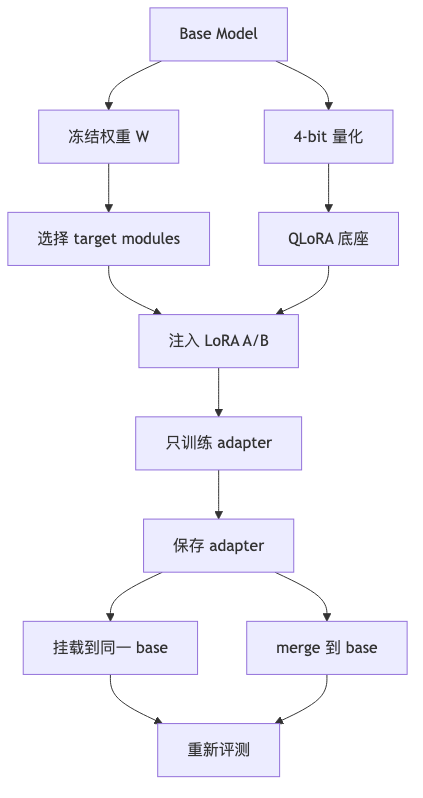

# 第 10 章：LoRA / QLoRA 参数高效微调

## 1. 本章真正要解决的问题

第 9 章的 SFT 默认可以更新模型参数。但一个 7B、14B 或更大的模型，全量微调会带来显存、存储、分发和回滚成本。领域项目常常不需要重写全部知识，只需要让模型在少量任务方向上发生可控偏移。

LoRA 的核心思想是：冻结原模型权重，只训练低秩增量矩阵。QLoRA 再进一步：把冻结的 base model 量化到 4-bit，把可训练部分留给 LoRA adapter。

核心问题：

```text
全量微调太贵，为什么只训练少量低秩 adapter 也能改变模型行为？
```

## 2. 问题链

1. 全量微调改动大，显存、存储和回滚成本都高。
2. 新问题：只改少量参数，怎么影响大矩阵的行为？
3. 新机制：LoRA 把 `W` 冻结，只训练低秩增量 `Delta W = B @ A`。
4. 新边界：低秩容量有限，rank `r`、`alpha` 和数据质量成为关键选择。
5. 新问题：adapter 应该注入哪些线性层？
6. 新机制：`target_modules` 决定 adapter 影响 attention、MLP 或其他投影层。
7. 新问题：部署时要保留 adapter 还是 merge 进 base？
8. 新机制：Adapter 可以单独保存、加载、切换或 merge，但 merge 必须重新评测。
9. QLoRA 用 4-bit quantized base model + LoRA 进一步降低显存。
10. 下一章问题：adapter 训练再便宜，也救不了脏数据；领域能力来自什么样的数据工程？

<



## 3. Concept Card

| 概念 | 数学对象 | Shape | 代码对象 | 实验对象 |
| --- | --- | --- | --- | --- |
| frozen weight | 原始权重 | `(out, in)` | base model | 不更新检查 |
| LoRA A | 降维矩阵 | `(r, in)` | `lora_A` | rank 对比 |
| LoRA B | 升维矩阵 | `(out, r)` | `lora_B` | update norm |
| rank | 低秩容量 | scalar | `r` | 欠拟合/过拟合 |
| alpha | 缩放系数 | scalar | `lora_alpha` | 稳定性 |
| target modules | 注入位置 | module names | `target_modules` | 参数量 |
| quantized base | 量化权重 | 4-bit storage | bitsandbytes | 显存占用 |

## 4. LoRA 的数学对象

对一个线性层：

```text
y = x @ W.T
```

LoRA 不直接训练 `W`，而是训练一个低秩增量：

```text
y = x @ W.T + scale * x @ A.T @ B.T
scale = alpha / r
```

其中：

```text
W: FloatTensor[out, in]   frozen
A: FloatTensor[r, in]     trainable
B: FloatTensor[out, r]    trainable
r << min(in, out)
```

如果 `r` 很小，adapter 容量有限但便宜；如果 `r` 很大，接近全量微调但成本上升。

LoRA 的直觉可以理解为：不要直接改动原始权重矩阵，而是在旁边学习一个低秩“修正方向”。原模型保留通用能力，adapter 学习领域任务需要的偏移。这样做的工程收益是：

```text
训练显存更低
保存产物更小
多个领域 adapter 可以切换
回滚比全量模型更简单
```

但这也意味着 adapter 依赖 base model。adapter 不是完整模型，脱离对应 base revision 就无法解释。

### LoRA 为什么一开始不破坏原模型

常见 LoRA 初始化会让：

```text
A: 随机初始化
B: 初始化为 0
```

因此训练刚开始时：

```text
Delta W = B @ A = 0
```

模型行为与原 base model 几乎一致。训练过程中，adapter 才逐渐学出一个低秩修正方向。

这个设计很重要：LoRA 不是一上来就覆盖原模型，而是在冻结原权重旁边学习一个增量。它保留了回滚和切换 adapter 的工程空间。

## 5. PEFT 工作流

典型代码结构：

```python
from peft import LoraConfig, TaskType, get_peft_model
from transformers import AutoModelForCausalLM

model = AutoModelForCausalLM.from_pretrained(model_id)
config = LoraConfig(
    task_type=TaskType.CAUSAL_LM,
    r=8,
    lora_alpha=16,
    lora_dropout=0.05,
    target_modules=["q_proj", "v_proj"],
    bias="none",
)
model = get_peft_model(model, config)
model.print_trainable_parameters()
```

本章不要求记住所有模型的模块名，而要学会检查模型结构。不同架构可能叫 `q_proj/v_proj`、`c_attn`、`query_key_value`，盲目复制 `target_modules` 很容易没有注入到正确位置。

检查模块名的最小代码：

```python
for name, module in model.named_modules():
    if "proj" in name or "attn" in name or "mlp" in name:
        print(name, module.__class__.__name__)
```

注入 LoRA 后还要看 trainable parameter ratio，并抽查目标层里是否真的出现了 `lora_A` / `lora_B`。如果 `print_trainable_parameters()` 显示可训练参数为 0，或者目标模块名完全没匹配上，训练脚本也可能照样跑完，但 adapter 什么都没学到。

## 6. Adapter 保存、加载与合并

LoRA 训练产物主要是 adapter，不是完整 base model：

```text
base model id + adapter weights + tokenizer + chat template + training config
```

常见操作：

- 单独保存 adapter，便于分发和多任务切换。
- 加载同一个 base model，再挂载 adapter。
- merge adapter 到 base 权重，便于部署，但会失去轻量切换优势。
- 保留 adapter config，记录 rank、alpha、target modules 和 base model revision。

如果只保存 adapter 而不记录 base model revision，未来加载到不同 base 权重上，行为可能不可复现。

### merge 不是永远应该做

merge adapter 的好处是部署时少挂一层 adapter，推理结构更简单。代价是：

1. 多个 adapter 不能再轻松切换。
2. 回滚不如单独 adapter 方便。
3. 对量化加载的 base model，merge 和导出格式更容易出错。
4. merge 后要重新跑同一套 eval，不能假设行为完全不变。

教学项目建议同时保留：

```text
base model revision
adapter weights
adapter config
unmerged eval report
merged eval report
```

这样才能判断 merge 是否影响格式、引用、安全拒答和领域表现。

## 7. QLoRA 的边界

QLoRA 的工程目标是降低显存：冻结 base model 用 4-bit 量化存储，反向传播只训练 LoRA adapter。常见流程：

```text
load base model in 4-bit
prepare model for k-bit training
inject LoRA adapter
run SFT
save adapter
```

因此 QLoRA 不是“训练 4-bit 权重”，而是“量化冻结底座 + 训练 adapter”。底座的量化方式、adapter 的 dtype、optimizer 和导出格式都要进入报告。

QLoRA 不等于“模型变成 4-bit 后所有计算都没有成本”。它仍然需要激活显存、optimizer state、batch 和序列长度管理。长上下文和大 batch 仍可能 OOM。

QLoRA 还引入了质量验证问题：量化后的 base 加上 adapter，行为不一定和非量化训练完全一致。教学项目可以先用 dry run 验证流程，再在同一 eval prompt 上比较：

```text
base fp16
LoRA fp16
QLoRA 4-bit + adapter
```

如果 QLoRA 版本格式更差或拒答边界退化，就要把这种差异写进评测报告，而不是只报告显存节省。

## 8. 参数量与显存估算

对一个线性层 `W(out, in)`，全量训练参数量是：

```text
out * in
```

LoRA 新增参数量是：

```text
r * in + out * r = r * (in + out)
```

如果 `in = out = 4096`，`r = 8`：

```text
full: 4096 * 4096 = 16,777,216
LoRA: 8 * (4096 + 4096) = 65,536
```

这个数量级差异解释了为什么 adapter 更便宜，也提醒我们：rank 太小会限制可表达的任务变化。

参数量估算是选择方案的第一步，不是最终答案。真正的工程决策还要看：

```text
目标任务是否只是格式/风格适配，还是需要复杂新能力
训练数据规模是否支撑更高 rank
部署时是否需要 merge adapter
是否要同时维护多个领域 adapter
评测是否显示低 rank 已经足够
```

不要把 LoRA 当成万能开关。数据差、评测弱、任务边界不清时，参数高效微调只会更高效地学到错误目标。

什么时候不要优先用 LoRA 解决：

| 情况 | 更应该先做什么 |
| --- | --- |
| 输出没有证据或引用 | 先补 RAG 和 citation support eval |
| 样本来源不可追踪 | 先做数据工程和 source_id |
| 任务边界不清 | 先写 intended use、拒答样本和 eval |
| 知识频繁更新 | 先用 RAG，而不是把知识塞进 adapter |
| 安全指标未定义 | 先做第 14、15 章的评测与门禁 |

## 9. 必写实验

- 打印 trainable parameter ratio，确认 base model 冻结。
- 比较 `r=4/8/16` 在同一 tiny SFT 数据上的 loss 与输出变化。
- 只注入 attention 层 vs 注入更多 linear 层，比较参数量和效果。
- 保存 adapter 后重新加载，验证同一 prompt 行为一致。
- QLoRA 小模型 dry run：记录显存、batch size、max length 与 OOM 边界。

## 10. 失败模式

- `target_modules` 写错：训练参数为 0 或 adapter 注入到非预期层。
- 忘记冻结 base：显存突然接近全量微调。
- 只报告 loss，不报告 trainable parameter ratio。
- adapter 与 base model revision 不匹配。
- merge 后还以为能无损切换多个 adapter。
- QLoRA 量化加载成功，但序列长度过大仍然 OOM。
- rank 越大越好：小数据下可能更快过拟合。

## 11. 测试验收

本章 tests 至少验证：

1. 注入 LoRA 后 trainable parameters 只包含 adapter。
2. `target_modules` 找不到时显式失败，而不是静默训练。
3. tiny batch 前向输出 logits shape 不变。
4. 训练前 LoRA 增量为 0 或近似 0，base 输出不被初始 adapter 扰动。
5. 训练一步后 base frozen 权重不变，adapter 权重变化。
6. 保存 adapter 后重新加载，输出 logits shape 与生成流程可用。
7. merge 后重新跑固定 eval prompts，确认行为没有未记录退化。

## 12. 本章记忆锚点与边界

本章最重要的一句话是：

> LoRA 不是重写模型，而是在冻结底座旁边学习一个可保存、可切换、可回滚的低秩增量。

你需要记住：

1. 常见初始化让 `B=0`，初始 `Delta W=0`。
2. `target_modules` 必须按具体架构检查。
3. rank 越高不一定越好，小数据可能更快过拟合。
4. QLoRA 是量化冻结 base + 训练 adapter。
5. merge 之后必须重新跑 eval。

本章没有解决数据来源和质量。下一章进入领域数据工程。

## 13. 下一章

LoRA / QLoRA 解决了微调成本，但没有解决“训练数据从哪里来、质量如何证明、风险如何控制”。下一章进入领域数据工程。
