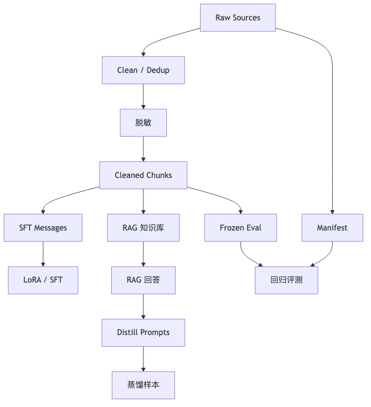

# 第 11 章：领域数据工程

## 1. 本章真正要解决的问题

第 10 章解决了微调成本，但没有解决能力来源。领域小模型往往不是因为 adapter 技巧本身变强，而是因为数据把任务边界、术语、格式、拒答和评测目标定义清楚了。

领域数据工程不是“收集越多越好”。法律、医学等高风险场景里，脏数据、泄漏数据、未脱敏数据和错误标签会直接变成模型行为风险。

核心问题：

```text
领域模型的能力主要来自哪里？模型，还是数据？
```

## 2. 问题链

1. LoRA 降低训练成本，但训练目标仍由数据决定。
2. 原始领域文档不能直接变成 SFT 样本。
3. 数据需要来源记录、许可边界、清洗、去重、脱敏和质量过滤。
4. SFT、RAG、蒸馏、评测需要不同数据形态。
5. 高风险领域必须显式标注拒答、不确定性和人工复核边界。
6. 数据版本必须能复现，否则模型版本不可解释。
7. 下一章问题：即使数据进入模型参数，知识也会过期；如何让模型回答前先查资料？

<



## 3. Concept Card

| 概念 | 数学对象 | Shape | 代码对象 | 实验对象 |
| --- | --- | --- | --- | --- |
| raw document | 原始资料 | text / PDF / HTML | `raw/` | 来源清单 |
| cleaned text | 清洗文本 | text chunks | `cleaned/` | 噪声率 |
| SFT example | 指令样本 | messages | `sft.jsonl` | schema check |
| eval item | 评测样本 | input + expected | `eval.jsonl` | 覆盖率 |
| metadata | 数据血缘 | dict | `source`, `license` | 可追踪性 |
| risk tag | 风险类别 | labels | `risk_tags` | 高风险切片 |

## 4. 数据分层

领域项目至少把数据分成四类：

```text
raw data:      原始文档，尽量不可修改，只追加来源元数据
cleaned data:  清洗、去重、脱敏后的文本
sft data:      instruction / messages / response
eval data:     不参与训练，只用于能力和风险评测
```

不要从同一份样本复制一份叫 train、一份叫 eval。评测集必须独立于训练过程，否则它只能证明模型记住了答案。

这四层数据的生命周期不同。Raw data 应尽量不可变，便于追溯；cleaned data 可以随着清洗规则升级重新生成；SFT data 是训练目标；eval data 是验收标准。把它们混在一个目录里，会让后续每次训练都变成考古。

同一条合同条款在不同阶段应该变成不同数据形态：

```text
raw doc -> cleaned chunk -> SFT message -> eval item -> distill prompt
```

例如“赔偿一切损失，包括间接损失、可得利益损失及律师费”：

| 形态 | 保存什么 | 用途 |
| --- | --- | --- |
| raw doc | 原始脱敏合同、来源、版本 | 追溯和许可审查 |
| cleaned chunk | 条款文本、条款号、source_id | RAG 检索 |
| SFT message | user 指令 + assistant 风险 JSON | 训练输出格式和边界 |
| eval item | input、expected_behavior、risk_tags | 评测和回归 |
| distill prompt | query + retrieved_context + teacher config | 生成候选蒸馏样本 |

不要把它们互相替代。SFT 样本不是 RAG 知识库，eval item 也不是训练样本。

一个实用原则是：任何进入模型参数的数据，都要知道它来自哪份 raw source；任何用于评测的数据，都要能证明它没有进入训练。

### eval set 要尽早冻结

很多项目会先训练，发现效果不错后再临时拼一个 eval set。这很危险，因为你很容易把训练过程中已经看过、调过、人工挑过的样本放进评测。

更稳的做法是：

```text
先定义 intended use / out-of-scope use
-> 先写一小版 eval set
-> 再做 SFT / RAG / 蒸馏数据
-> 每次训练后跑同一套 eval
```

eval set 不一定一开始很大，但必须独立、可追踪、版本固定。否则评测报告只能说明“这次挑的样例看起来不错”，不能说明模型真的变好了。

## 5. 数据记录字段

每条领域样本建议至少包含：

```json
{
  "id": "contract_000123",
  "source_id": "doc_2026_001",
  "source_type": "contract_clause",
  "created_by": "manual|rule|teacher_model",
  "license": "internal_review_only",
  "usage_scope": ["train", "eval", "rag"],
  "contains_personal_data": false,
  "risk_tags": ["contract", "liability", "needs_human_review"],
  "messages": [
    {"role": "system", "content": "你是谨慎的合同风险分析助手。"},
    {"role": "user", "content": "分析以下条款的风险：..."},
    {"role": "assistant", "content": "该条款可能存在..."}
  ]
}
```

这些字段看起来繁琐，但后续能回答三个关键问题：

1. 这个能力来自哪批数据？
2. 出错时能否定位样本来源？
3. 这条样本是否允许用于训练、评测或发布？

raw data 不等于可训练数据。尤其法律/医学领域，即使技术上能训练，也不代表许可、隐私和风险上允许训练。许可与使用边界要写进 manifest 和数据质量报告。

## 6. 清洗与去重

清洗不是把文本变漂亮，而是降低训练噪声：

- 去掉页眉页脚、目录、水印、乱码。
- 统一全角/半角、空白、换行、编号格式。
- 删除重复段落和近重复样本。
- 保留法律条文、医学指南等结构化编号。
- 标记不确定来源，不直接混入高质量训练集。

近重复比完全重复更危险。合同条款、医学问答、法规摘录常常只有少量词不同，如果 train/test 同时出现近重复，评测会虚高。

去重也要区分“语义重复”和“结构重复”。法律合同里很多条款模板相似，但金额、责任范围或例外条件不同；医学资料里同一症状在成人、儿童、孕妇场景下处理边界不同。过度去重会删掉关键差异，去重不足又会导致泄漏。

因此数据质量报告里应记录被删除样本和删除原因，而不是只给一个最终数量。

### 近重复检查要工程化

近重复不能只靠肉眼看。建议至少做一层粗筛：

```text
字符 n-gram overlap
MinHash / SimHash
source_id / source_group 去重
标题、编号、条款号规则匹配
```

法律和医学数据尤其容易出现“看起来不同、实质相同”的样本：

```text
同一合同模板换了金额
同一医学指南换了标题
同一 teacher prompt 生成了多个近似答案
```

如果这些近重复同时进入 train 和 test，评测会虚高。去重报告应记录：

```text
重复类型
被删除样本 id
保留样本 id
删除原因
```

## 7. 脱敏与风险控制

法律和医学数据必须默认存在隐私风险。脱敏至少覆盖：

- 姓名、身份证、电话、地址、病历号、合同编号。
- 机构内部编号和商业秘密。
- 可组合识别个人身份的少见字段。

脱敏后要保留任务必要结构。例如合同金额可以保留为 `<AMOUNT>`，日期可以保留为 `<DATE>`，否则模型会失去风险判断所需的上下文形态。

高风险样本应带上显式标签：

```text
needs_human_review
medical_emergency
legal_advice_boundary
privacy_sensitive
insufficient_context
```

这些标签后续会进入评测、安全拒答和 model card。

## 8. SFT 数据构造

在进入具体构造前，先把组件边界写硬：

| 组件 | 使用的数据形态 | 主要作用 | 不能替代什么 |
| --- | --- | --- | --- |
| SFT | approved messages | 学会输出格式、语气和拒答边界 | 不能保证事实新鲜或 citation 真实 |
| LoRA | SFT / distill train split | 降低训练成本 | 不能修复脏数据 |
| RAG | cleaned chunks + metadata | 提供可更新证据 | 不能保证模型正确使用证据 |
| 蒸馏 | teacher outputs + filters | 扩充可验证行为样本 | 不能把 teacher 当事实来源 |
| Eval | frozen eval items | 暴露失败和回归 | 不能参与训练 |

SFT 样本不是文档摘要的随意改写。每条样本都应该对应一个可观察能力：

- 格式能力：按固定 JSON 或表格输出。
- 术语能力：正确使用领域概念。
- 引用能力：指出依据来自哪段材料。
- 拒答能力：在证据不足时说不知道。
- 边界能力：不替代律师或医生做最终判断。

低质量 SFT 样本会把模型训练成“流畅地犯错”。宁可先做 200 条高质量样本，也不要混入 2 万条不可追踪的弱样本。

## 9. 蒸馏数据构造

蒸馏数据来自 teacher model，但 teacher 不是事实来源。蒸馏样本必须经过过滤：

- teacher 是否引用了给定材料？
- 是否编造了不存在的条款、疾病或法规？
- 是否表达了不确定性？
- 是否越过法律/医学建议边界？
- 是否符合目标输出格式？

蒸馏样本要保留 teacher model id、prompt 版本、生成参数和过滤状态。

## 10. 评测数据构造

评测集要覆盖成功和失败：

- 常规能力：正确抽取、解释、归纳。
- 事实能力：答案是否被证据支持。
- 格式能力：输出能否被程序解析。
- 拒答能力：信息不足时是否拒绝。
- 风险能力：高风险场景是否提示人工复核。
- 鲁棒性：错别字、缺字段、超长上下文。

评测数据不能只由训练数据改写而来。最好按 source group 切分，保证同一原始文档不会同时进入 train 和 test。

## 11. 数据质量报告

每次训练前应生成数据质量报告：

```text
样本数量
来源分布
长度分布
重复率 / 近重复率
脱敏命中数量
风险标签分布
train/val/test 切分规则
schema 错误数量
人工抽检结论
```

报告不是装饰。它是解释模型行为的证据链。

数据质量报告应该在训练之前生成，而不是训练失败后补写。报告能帮你提前发现：

```text
某个来源占比过高，模型可能学偏
高风险标签太少，安全评测大概率失败
样本长度超过 max_length，答案会被截断
重复率过高，val loss 会虚低
脱敏命中异常，可能有隐私泄漏
```

后续 eval report 和 model card 都应该引用数据质量报告。这样模型效果不是孤立数字，而是和数据来源、清洗、风险标签连在一起。

最小 `data_quality_report.md` 可以先只有这些字段：

```markdown
# Data Quality Report

- dataset_version:
- raw_sources:
- license_or_usage_scope:
- split_rule:
- train_count / val_count / test_count:
- duplicated_or_near_duplicated_count:
- privacy_redaction_summary:
- risk_tag_distribution:
- max_length_overflow_count:
- schema_error_count:
- manual_spot_check_result:
- known_limitations:
```

这份报告不需要一开始很长，但必须在训练前生成，并且被训练配置、eval report 和 model card 引用。

## 12. 必写实验

- 对 SFT jsonl 做 schema validation，统计非法 role、空回答、超长样本。
- 对 train/test 做重复和近重复检查。
- 对敏感字段做脱敏命中测试。
- 训练前输出数据质量报告，并把报告路径写进训练配置。
- 构造一组拒答样本，验证它们进入 eval 而不是只进入 train。
- 用同一份合同条款分别构造 SFT 样本、RAG chunk、蒸馏 prompt 和 eval item，观察字段如何变化。

## 13. 失败模式

- 数据来源不可追踪：模型出错后无法定位。
- train/test 泄漏：评测指标看起来很高，真实泛化很差。
- 过度清洗：删掉编号、金额、时间等关键风险信息。
- 只收正例：模型不知道什么时候拒答。
- teacher 蒸馏不审查：把 hallucination 当成领域知识。
- 数据版本不固定：同一个训练命令下次得到不同模型。

## 14. 测试验收

本章 tests 至少验证：

1. 每条 SFT / eval 样本有唯一 `id` 和 `source_id`。
2. message role 只允许 `system/user/assistant`。
3. train / val / test 没有重复 id，也没有重复 source group。
4. 脱敏函数能替换测试样本中的电话、身份证、地址占位。
5. 数据质量报告包含样本数、长度分布、风险标签和重复率。

## 15. 本章记忆锚点与边界

本章最重要的一句话是：

> 领域模型的行为首先由数据定义，微调方法只是把这种定义写进模型或流程。

你需要记住：

1. raw、cleaned、SFT、RAG、distill、eval 是不同数据形态。
2. 每条样本都要能追踪 source、license、risk_tags 和使用边界。
3. eval set 要独立于训练并尽早冻结。
4. 脱敏不能破坏任务必要结构。
5. 数据质量报告是训练前 gate，不是训练后装饰。

本章没有解决知识实时性和可追溯回答。下一章进入 RAG。

## 16. 下一章

即使数据工程做得很好，把所有知识写进参数也不现实。领域知识会更新，证据也需要可追溯。下一章进入 RAG：让模型回答前先检索外部资料。
